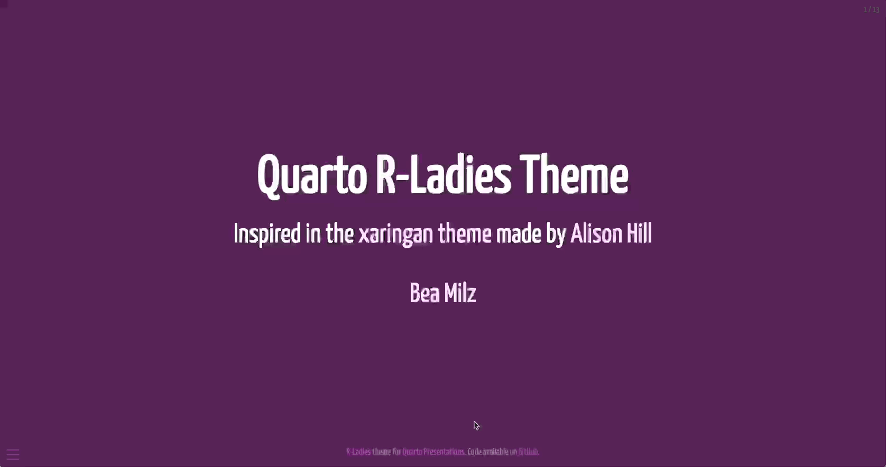

# Quarto R-Ladies Theme

This is a repository R-Ladies template using `Quarto` `reveal.js` :

<a href='https://beatrizmilz.github.io/quarto-rladies-theme/' target='_blank'>
</a>

The code to create this example is [available here](https://github.com/beatrizmilz/quarto-rladies-theme/blob/main/template.qmd).

## How to install

This [Quarto](https://quarto.org) extension can be installed using the following command:

``` bash
quarto install extension beatrizmilz/quarto-rladies-theme
```

## Acknowledgments

- [Beatriz Milz](https://github.com/beatrizmilz) 

- [Mickaël Canouil](https://github.com/mcanouil) 

- Inspired in the xaringan theme made by [Alison Hill](https://www.apreshill.com/)
